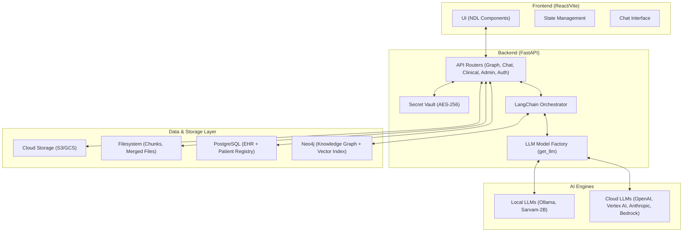
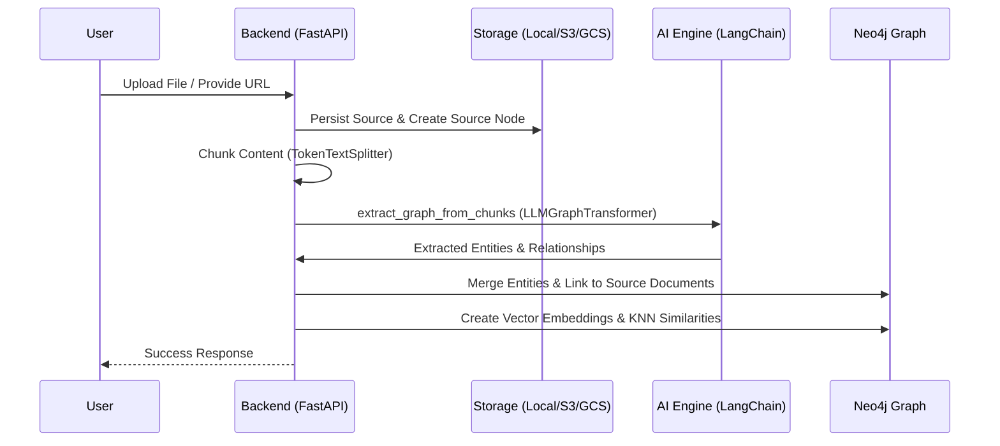
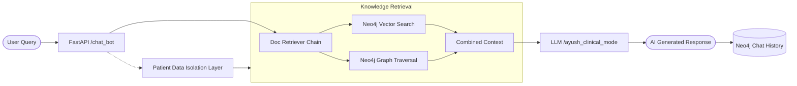
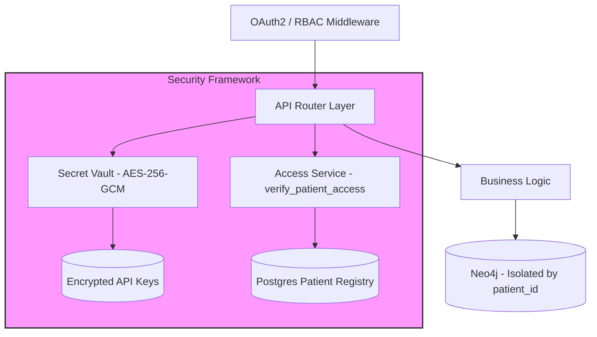

# Technical Specification: Neo4j LLM Graph Builder

## 1. Executive Summary

The **LLM Graph Builder** is an advanced application designed to transform unstructured data (PDFs, YouTube videos, Web pages, etc.) into structured **Knowledge Graphs** stored in Neo4j. By leveraging Large Language Models (LLMs) and the LangChain framework, it automates the extraction of nodes and relationships, enabling complex semantic retrieval and Retrieval-Augmented Generation (RAG) chat capabilities.

## 2. System Architecture

The application follows a decoupled microservices architecture, containerized via Docker.

### 2.1 Component Diagram



## 3. Core Workflows

### 3.1 Data Ingestion & Chunking

1. **Upload**: User uploads files or provides URLs (S3, GCS, YouTube, Wiki).
2. **Processing**: files are processed into text chunks.
    - *Configurable parameters*: Chunk size, overlap, and token limits.
3. **Storage**: Chunks are stored as `Chunk` nodes in Neo4j, linked sequentially (`NEXT_CHUNK`) and to their source `Document`.

### 3.2 Graph Extraction Pipeline (Program Flow)



### 3.3 Clinical Intelligence Engine

The application includes a specialized pipeline for medical data, primarily for the **AYUSH** (Hypertension) use case.

1. **Semantic Inference**: Uses LLMs to autonomously infer clinical statuses (e.g., BP categories like `Stage2`) and patient risks (Red Flags) from unstructured notes.
2. **Structured Extraction**: Maps clinical text to a [Generalized EHR Schema](file:///Users/lakshminarasimhan.santhanamgigkri.com/Aushadha/GENERALIZED_EHR_SCHEMA.json).
3. **Indic Language Support**: Leverages **Sarvam AI** (remote or local 2B model) for high-performance processing of Indian regional languages.

### 3.4 Retrieval Augmented Generation (Data Flow)



## 4. Security Architecture

### 4.1 Authentication

- **Auth0**: Supports integration for user authentication (optional via `VITE_SKIP_AUTH`).
- **Neo4j Utils**: Direct database authentication handling via `neo4j-driver`.

### 4.3 Secure Design Visualized



## 5. Technology Stack

| Component | Technology | Description |
| :--- | :--- | :--- |
| **Frontend** | React, TypeScript, Vite | UI Rendering and State Management |
| **UI Library** | Neo4j NDL | Standardized Neo4j look and feel |
| **Backend** | Python 3.12, FastAPI | REST API & Async Task Management |
| **Orchestration** | LangChain | LLM chains and Graph Transformers |
| **Database** | Neo4j 5.23+, Postgres 16 | Graph + Relational Storage |
| **Indic LLM** | Sarvam AI / Sarvam-2B | Specialized Indic Language Support |
| **Containerization** | Docker, Docker Compose | Deployment and Orchestration |

## 6. Key Configuration & Environment

The application is highly configurable via Environment Variables (see `README.md` for full list).

- **`VITE_LLM_MODELS_PROD`**: Controls the list of available models in the UI.
- **`NEO4J_URI` / `NEO4J_PASSWORD`**: Database connection details.
- **`OPENAI_API_KEY` / `DIFFBOT_API_KEY`**: Core Model Credentials.

## 7. Implementation Status (as of 21 Feb 2026)

### 7.1 Backend

| Feature | Status | Key Files | Notes |
| :--- | :---: | :--- | :--- |
| **FastAPI Server** | ✅ Done | `score.py` (1 482 lines, 25+ endpoints) | Health, CORS, GZip, session middleware |
| **Data Ingestion** (local, S3, GCS, YouTube, Wiki, Web) | ✅ Done | `main.py`, `src/document_sources/` | All six source types implemented |
| **Graph Extraction Pipeline** (LLMGraphTransformer) | ✅ Done | `llm.py` → `get_graph_from_llm` | Supports schema-guided and free extraction |
| **Diffbot Integration** | ✅ Done | `diffbot_transformer.py`, `llm.py` | Via `LlmModelConfig` env resolution |
| **Clinical Intelligence Engine** | ✅ Done | `llm.py` → `extract_structured_ehr_data`, `validate_clinical_content` | Autonomous LLM-based semantic inference for BP categories, red flags, lifestyle suspicions; uses `HYPERTENSION_RULES` & `HYPERTENSION_INFERENCE_RULES` |
| **Generalized EHR Schema** | ✅ Done | `GENERALIZED_EHR_SCHEMA.json` | JSON Schema (Draft-07) for patient context, clinical data, risk assessment |
| **PostgreSQL (EHR Storage)** | ✅ Done | `database.py`, `models.py` | SQLAlchemy ORM: `Patient`, `Visit`, `Vital`, `Symptom`, `LifestyleFactor` tables |
| **EHR CRUD API** | ✅ Done | `score.py` → `get_ehr_data`, `update_ehr_data` | Read & update EHR records from Postgres |
| **EHR ↔ KG Sync** | ✅ Done | `score.py` → `sync_ehr_to_kg` | Pushes clinical records (incl. lifestyle factors) from Postgres → Neo4j |
| **Sarvam AI (Remote)** | ✅ Done | `llm.py` (line ~82) | OpenAI-compatible routing via `api.sarvam.ai/v1` |
| **Sarvam Local-2B** | ✅ Done | `llm.py` (line ~201), `local-llm/` dir | Local model loading + proxy service |
| **Secret Vault** | ✅ Done | `shared/secret_vault.py` | AES encryption → `.vault.key` + `.secrets.json.enc` |
| **Token Usage Tracking** | ✅ Done | `shared/common_fn.py` → `track_token_usage`, `get_remaining_token_limits` | Daily/monthly tracking with Neo4j User nodes |
| **Token Reset Cron Jobs** | ✅ Done | `cronjob/reset_daily_tokens/`, `cronjob/reset_monthly_tokens/` | Separate daily and monthly reset scripts |
| **RAG Chat (Vector / Graph / Hybrid)** | ✅ Done | `score.py` → `chat_bot`, `graph_query.py` | Multiple retrieval modes |
| **Post-Processing** (duplicates, orphans, communities) | ✅ Done | `post_processing.py`, `communities.py`, `score.py` endpoints | Graph cleanup, dedup, orphan removal |
| **RAGAS Evaluation** | ✅ Done | `ragas_eval.py`, `score.py` → `calculate_metric` | Faithfulness, context recall metrics |
| **Schema Extraction** | ✅ Done | `shared/schema_extraction.py` | LLM-powered schema inference from text |
| **Embedding Support** | ✅ Done | `common_fn.py` → `load_embedding_model` | Supports HuggingFace (all-MiniLM-L6-v2), OpenAI, VertexAI, Bedrock |
| **Cloud Build (GCP Deploy)** | ⚠️ Planned | (not yet created) | `cloudbuild.yaml` referenced in README but file does not exist |
| **Ailment-Agnostic Generalization** | ⚠️ Spec Only | `AILMENT_AGNOSTIC_PLAYBOOK.md`, `AILMENT_AGNOSTIC_REQUIREMENTS.md` | Requirements documented; code is currently Hypertension-specific |

### 7.2 Frontend

| Feature | Status | Key Files | Notes |
| :--- | :---: | :--- | :--- |
| **React + TypeScript + Vite** | ✅ Done | `frontend/src/`, `vite.config.ts` | Hot-reload dev server |
| **Neo4j NDL UI Library** | ✅ Done | Component tree uses `@neo4j-ndl/react` | Drawer, Dialog, DataGrid, etc. |
| **File Upload & Source Management** | ✅ Done | `FileTable.tsx` (43 KB), `DataSources/` | Multi-source upload with chunked large-file support |
| **Graph Visualization** (Bloom) | ✅ Done | `components/Graph/` (10 sub-components) | Embedded Bloom iframe |
| **RAG Chatbot Drawer** | ✅ Done | `Layout/DrawerChatbot.tsx`, `ChatBot/` (16 sub-components) | Push-drawer with session management |
| **Speech Recognition Hook** | ✅ Done | `hooks/useSpeechRecognition.tsx` | WebKit Speech API; accepts language parameter for Indic support |
| **Auth0 / Skip-Auth** | ✅ Done | `components/Auth/`, `HOC/` | Toggleable via `VITE_SKIP_AUTH` |
| **Saffron/Orange Theme** | ✅ Done | `App.css`, `theme-overrides.css`, `index.css` | Custom NDL overrides |
| **Secret Vault UI** | ✅ Done | (via API calls in `services/`) | List / save / retrieve secrets |
| **Schema Editor** | ✅ Done | `Popups/` (25 sub-components) | Entity/relationship schema configuration |
| **Global Language Context** | ✅ Done | `context/LanguageContext.tsx`, `UI/LanguageSelector.tsx` | 11 Indic languages; drives speech, chat, and LLM responses |
| **Clinical Intelligence UI Panel** | ✅ Done | `UI/EHRTabularView.tsx`, `Content.tsx` | Full CRUD: view, edit, sync-to-KG |
| **Indic Language Input (Speech + LLM)** | ✅ Done | `useSpeechRecognition.tsx`, `QnaAPI.ts`, `score.py` | Speech recognition + LLM responses in selected language |
| **Token Usage Dashboard** | ❌ Not Started | — | Backend API exists but no frontend view |

### 7.3 Infrastructure / DevOps

| Feature | Status | Key Files | Notes |
| :--- | :---: | :--- | :--- |
| **Docker Compose (6 services)** | ✅ Done | `docker-compose.yml` | Neo4j 5.23, Backend, Frontend, Postgres 16, Local-LLM, LLM-Proxy |
| **Backend Dockerfile** | ✅ Done | `backend/Dockerfile` | Python 3.12 base |
| **Frontend Dockerfile** | ✅ Done | `frontend/Dockerfile` | Node 20 + nginx |
| **Local LLM Container** | ✅ Done | `local-llm/docker/Dockerfile` | Model serving + OpenAI-compat proxy |
| **GCP Cloud Build** | ❌ Not Started | — | Referenced in README but `cloudbuild.yaml` is missing |
| **CI/CD (GitHub Actions)** | ⚠️ Partial | `.github/` (3 files) | Workflow stubs exist |

### 7.4 Overall Progress Summary

```text
Backend  ·········· ████████████████████░░  ~90%
Frontend ·········· ██████████████████░░░░  ~85%
DevOps   ·········· ██████████████████░░░░  ~80%
─────────────────────────────────────────────
Overall  ·········· █████████████████░░░░░  ~85%
```

**Key gaps to close:**

1. **Token Usage Dashboard** — surface the existing backend metrics in the UI
2. **GCP Cloud Build** — create `cloudbuild.yaml` for automated deployment
3. **Ailment Generalization** — extend the rules engine and EHR schema beyond Hypertension

## 8. Recent Improvements (Feb 2026)

- **Universal Model Support**: Refactored `get_llm` to support dynamic configuration for generic providers (Anthropic, Fireworks, etc.) without code changes.
- **Robust Error Handling**: Fixed specific model name mapping issues (e.g., `OPENAI_GPT_4O` -> `gpt-4o`) to prevent SDK errors.
- **UX Enhancements**: Implemented a Saffron/Orange theme for better visibility and simplified the header navigation.
- **Clinical Intelligence Engine**: Implemented autonomous LLM-based semantic inference for structured EHR extraction, BP categorization, red flag detection, and lifestyle suspicion analysis.
- **PostgreSQL Integration**: Added relational storage for structured clinical records with full CRUD API.
- **EHR ↔ KG Sync**: Built bidirectional pipeline to push validated clinical data from Postgres into the Neo4j Knowledge Graph.
- **Token Usage Tracking**: Added daily/monthly token metering with Neo4j-backed User nodes and cron reset jobs.
- **Secret Vault**: Encrypted credential storage with AES for API keys, persisted locally.
