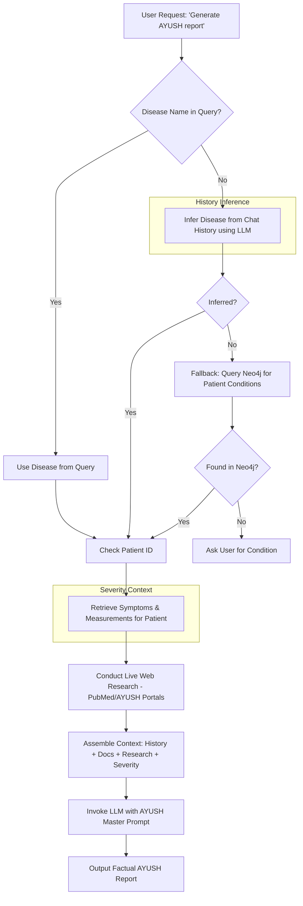

# AYUSH Report Generation Flow

This diagram illustrates the enhanced process for generating an AYUSH clinical research report, incorporating conversational history and Neo4j entity data.

## Key Enhancements
1. **History Inference**: Uses the LLM to understand what disease was discussed previously, even if the current query is generic.
2. **Neo4j Fallback**: Correctly queries for entities prefixed with the `patient_id` (e.g., `PT-AP-SANTHO_hypertension`) instead of looking for a non-existent `Patient` label.
3. **Severity Integration**: Explicitly pulls measurements (e.g., BP `128/82`) and symptoms (e.g., `headaches`) from the graph to provide specific context for the clinical report.
